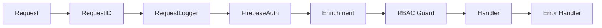

# Go Kit

`go-kit` is a lightweight, opinionated production-ready toolkit for building scalable microservices in Go. It provides a standardized architecture based on managed lifecycles, structured observability, and consistent error handling.

## Core Features

### 🚀 Lifecycle Management ([pkg/launcher](file:///home/renenochebuena/Workspace/go-kit/pkg/launcher))
Managed application startup and shutdown. Components register `OnInit`, `OnStart`, and `OnStop` hooks to handle dependencies and graceful transitions.

### 🔐 Security & Identity ([pkg/authz](file:///home/renenochebuena/Workspace/go-kit/pkg/authz), [pkg/fb](file:///home/renenochebuena/Workspace/go-kit/pkg/fb))
Unified `Identity` model for user propagation. Integrated with **Firebase Admin SDK** for token verification and bitmask-based **RBAC** for fine-grained access control.
- **Stateless RBAC**: High-performance $O(1)$ authorization using bitmask comparisons (supporting up to 63 permissions per application).
- **Firebase Auth**: Requires `GOOGLE_APPLICATION_CREDENTIALS` environment variable for service account authentication.

### 🌐 Web & Middleware ([pkg/server](file:///home/renenochebuena/Workspace/go-kit/pkg/server), [pkg/mw](file:///home/renenochebuena/Workspace/go-kit/pkg/mw))
Echo-based HTTP server with standardized middlewares.

#### Request Flow

Standardized middlewares for Error Handling, Enrichment (Tenant identification), Security (Auth/RBAC), and Request Tracing.

### 💾 Infrastructure ([pkg/pgutil](file:///home/renenochebuena/Workspace/go-kit/pkg/pgutil), [pkg/vkutil](file:///home/renenochebuena/Workspace/go-kit/pkg/vkutil))
Thread-safe, singleton-based clients for PostgreSQL (using `pgx`) and Valkey (using `valkey-go`).

---

## Getting Started

### Installation
```bash
go get github.com/nochebuenadev/go-kit
```

### Basic Example
```go
package main

import (
    "github.com/nochebuenadev/go-kit/pkg/launcher"
    "github.com/nochebuenadev/go-kit/pkg/logz"
    "github.com/nochebuenadev/go-kit/pkg/server"
)

func main() {
    // 0. Init Global Logger
    logz.MustInit("my-service")
    logger := logz.Global()
    
    // 1. Core Launcher
    l := launcher.New(logger)
    
    // 2. Setup Components
    srv := server.GetEchoServer(&server.Config{Port: 8080}, logger)
    
    // authProvider := myproject.NewAuthResolver(db, cache)
    // authorizer := mw.GetAuthorizer(logger, authProvider, "my-service-id")
    
    l.Append(srv)

    // 3. Run happily
    l.Run()
}
```

## Project Principles
1. **Singleton-First**: Infrastructure clients are managed as singletons to ensure safe resource reuse.
2. **Lifecycle Aware**: Every major component should implement the `launcher.Component` interface.
3. **Observability**: Logs and errors must carry correlation IDs and machine-readable context.
4. **Documentation Excellence**: 100% GoDoc coverage for both exported and internal (unexported) logic.
5. **Concurrency Safety**: Components like `health` and `worker` are designed for high-concurrency environments.

---

## Component Overview

| Package    | Description                                         |
|:-----------|:----------------------------------------------------|
| `apperr`   | Standardized error types and JSON marshaling.       |
| `authz`    | Identity propagation and bitmask-based RBAC.        |
| `check`    | Struct and field validation helpers.                |
| `fb`       | Firebase Admin SDK integration (singleton).         |
| `health`   | Parallel health check aggregation and HTTP handler. |
| `launcher` | App lifecycle registry and signal handling.         |
| `logz`     | Slog-based structured logger with context support.  |
| `mw`       | Echo middlewares (Auth, RBAC, Enrichment, Errors).  |
| `pgutil`   | PostgreSQL connection pool and error mapping.       |
| `server`   | HTTP server setup and lifecycle management.         |
| `vkutil`   | Valkey (Redis compatible) client and health check.  |
| `worker`   | Background task pool with backpressure.             |

## Testing
The toolkit maintains high test coverage across all packages.

```bash
go test -v ./pkg/...
```

## License
This project is licensed under the MIT License - see the [LICENSE](LICENSE) file for details.
